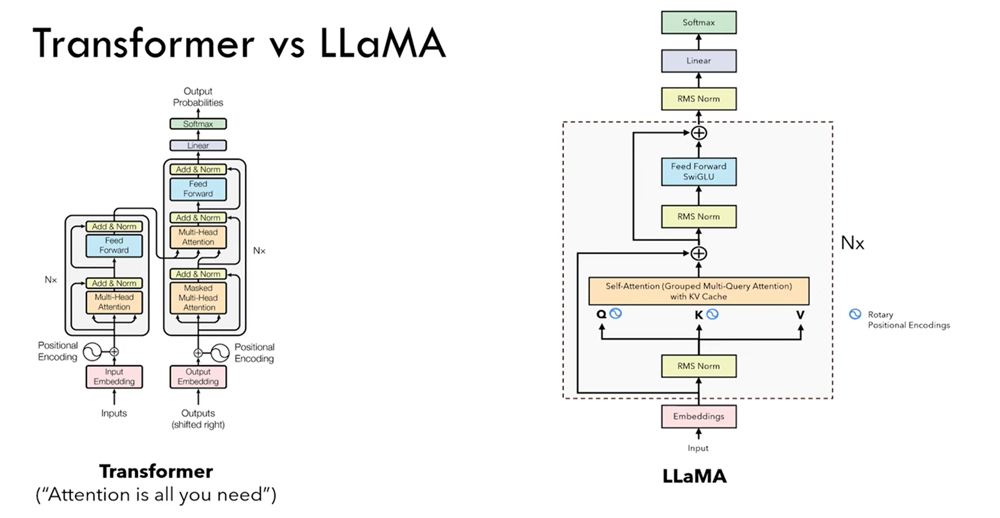

# Llama-2-scratch

## Transformer vs LLaMa


### Positional Embedding vs Rotary Positional Embedding
For each word in the sequence, an embedding is computed with which another embedding of the same dimension is added. We obtain this using sin/cosine frequencies. This embedding is known as the **positional embedding** which only determines the position of the word. Since it is the position of the word, it is only computed once and is also known as the **absolute positional embedding** since its fixed <br>
<br>
**Relative positional encoding** deals with two tokens at a time and it is involved when we calculate the attention: since the attention mechanism captures the "intensity" of how much two words are related to each other, relative positional encodings tell the attention mechanism the *distance* between the two words involved in it. So given two tokens, we create a vector that represents their distance. 

```math 
\text{absolute positional encoding}_{i,j} = \frac{(x_iW^Q)(x_jW^K)^T}{\sqrt{d_z}}
```
```math
\text{relative positional encoding}_{i,j} = \frac{(x_iW^Q)(x_jW^K + a_{i,j}^K)^T}{\sqrt{d_z}}
```
where **a** is the distance between the two vectors. 

**Rotary Positional Encoding** are between absolute and relative. Absolute because each token gets each embedding but relative since attention mechanism is applied. Can we find the inner product of the query and key such that it depends on the embedding and the relative distance between them? Think inner product as the generalization* of the dot product. <br>
Some math that you might not need to understand but feel free to go over 

```math 
f_q(x_m, m) = (W_qx_m)e^{im\theta}
```

```math 
f_k(x_n, n) = (W_k x_n)e^{in\theta}
```

These two functions for vectors **q** and **k** are converted to a complex number. The inner product is defined then as follows 
```math
g(x_m, x_n, m-n) = Re[(W_q x_m)(W_k x_n)*e^{i(m-n)\theta}]
```
where * = conjugate of the complex number. Using **Euler's Formula** into its matrix form which is a rotation matrix in a 2d space hence the name **rotary**. 

```math
f_{\{q,k\}}(x_m, m) = 
\underbrace{\begin{pmatrix}
\cos m\theta & -\sin m\theta \\
\sin m\theta & \cos m\theta
\end{pmatrix}}_{\text{Rotation Matrix}}
\begin{pmatrix}
W^{(11)}_{\{q,k\}} & W^{(12)}_{\{q,k\}} \\
W^{(21)}_{\{q,k\}} & W^{(22)}_{\{q,k\}}
\end{pmatrix}
\begin{pmatrix}
x_m^{(1)} \\
x_m^{(2)}
\end{pmatrix}
```

Two tokens that occupy similar positions will have similar inclincations. However this is not computationally efficient since its **sparse**

```math
R_{\Theta,m}^d \mathbf{x} =
\underbrace{\begin{pmatrix}
x_1 \\
x_2 \\
x_3 \\
x_4 \\
\vdots \\
x_{d-1} \\
x_d
\end{pmatrix}}_{\text{Embeddings}}
\otimes
\begin{pmatrix}
\cos m\theta_1 \\
\cos m\theta_1 \\
\cos m\theta_2 \\
\cos m\theta_2 \\
\vdots \\
\cos m\theta_{d/2} \\
\cos m\theta_{d/2}
\end{pmatrix}
+
\begin{pmatrix}
-x_2 \\
x_1 \\
-x_4 \\
x_3 \\
\vdots \\
-x_d \\
x_{d-1}
\end{pmatrix}
\otimes
\underbrace{\begin{pmatrix}
\sin m\theta_1 \\
\sin m\theta_1 \\
\sin m\theta_2 \\
\sin m\theta_2 \\
\vdots \\
\sin m\theta_{d/2} \\
\sin m\theta_{d/2}
\end{pmatrix}}_{\text{Positional Encoding}}
```

*Why complex?* <br>
Complex number is given by the following 
```math
a + il
```
where **a** is the real number and **L** is the complex number such that the squared of **i** will be -1. So complex numbers were invented to represent squares of negative number. This is helpful in vector calculations using **Euler's Formula**. 

```math
e^{ix} = cos(x) + isin(x)
```

So we transform the combinations of all **m** and **theta** (a matrix produced using an outer product between m and theta) to polar form which given as follows 
$$Re^{i\theta} = R cos(\theta) + Risin(\theta)
This helps us achieve the matrix required above. 


