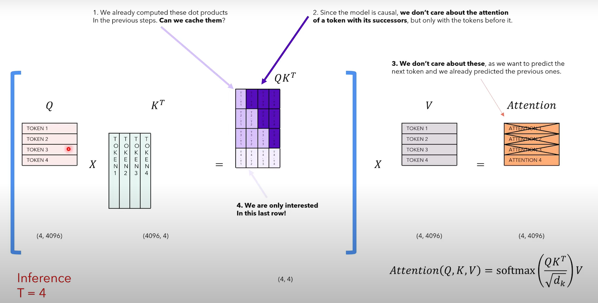

# Llama-2-scratch

## Transformer vs LLaMa


### Positional Embedding vs Rotary Positional Embedding
For each word in the sequence, an embedding is computed with which another embedding of the same dimension is added. We obtain this using sin/cosine frequencies. This embedding is known as the **positional embedding** which only determines the position of the word. Since it is the position of the word, it is only computed once and is also known as the **absolute positional embedding** since its fixed <br>
<br>
**Relative positional encoding** deals with two tokens at a time and it is involved when we calculate the attention: since the attention mechanism captures the "intensity" of how much two words are related to each other, relative positional encodings tell the attention mechanism the *distance* between the two words involved in it. So given two tokens, we create a vector that represents their distance. 

```math 
\text{absolute positional encoding}_{i,j} = \frac{(x_iW^Q)(x_jW^K)^T}{\sqrt{d_z}}
```
```math
\text{relative positional encoding}_{i,j} = \frac{(x_iW^Q)(x_jW^K + a_{i,j}^K)^T}{\sqrt{d_z}}
```
where **a** is the distance between the two vectors. 

**Rotary Positional Encoding** are between absolute and relative. Absolute because each token gets each embedding but relative since attention mechanism is applied. Can we find the inner product of the query and key such that it depends on the embedding and the relative distance between them? Think inner product as the generalization* of the dot product. <br>
Some math that you might not need to understand but feel free to go over 

```math 
f_q(x_m, m) = (W_qx_m)e^{im\theta}
```

```math 
f_k(x_n, n) = (W_k x_n)e^{in\theta}
```

These two functions for vectors **q** and **k** are converted to a complex number. The inner product is defined then as follows 
```math
g(x_m, x_n, m-n) = Re[(W_q x_m)(W_k x_n)*e^{i(m-n)\theta}]
```
where * = conjugate of the complex number. Using **Euler's Formula** into its matrix form which is a rotation matrix in a 2d space hence the name **rotary**. 

```math
f_{\{q,k\}}(x_m, m) = 
\underbrace{\begin{pmatrix}
\cos m\theta & -\sin m\theta \\
\sin m\theta & \cos m\theta
\end{pmatrix}}_{\text{Rotation Matrix}}
\begin{pmatrix}
W^{(11)}_{\{q,k\}} & W^{(12)}_{\{q,k\}} \\
W^{(21)}_{\{q,k\}} & W^{(22)}_{\{q,k\}}
\end{pmatrix}
\begin{pmatrix}
x_m^{(1)} \\
x_m^{(2)}
\end{pmatrix}
```

Two tokens that occupy similar positions will have similar inclincations. However this is not computationally efficient since its **sparse**

```math
R_{\Theta,m}^d \mathbf{x} =
\underbrace{\begin{pmatrix}
x_1 \\
x_2 \\
x_3 \\
x_4 \\
\vdots \\
x_{d-1} \\
x_d
\end{pmatrix}}_{\text{Embeddings}}
\otimes
\begin{pmatrix}
\cos m\theta_1 \\
\cos m\theta_1 \\
\cos m\theta_2 \\
\cos m\theta_2 \\
\vdots \\
\cos m\theta_{d/2} \\
\cos m\theta_{d/2}
\end{pmatrix}
+
\begin{pmatrix}
-x_2 \\
x_1 \\
-x_4 \\
x_3 \\
\vdots \\
-x_d \\
x_{d-1}
\end{pmatrix}
\otimes
\underbrace{\begin{pmatrix}
\sin m\theta_1 \\
\sin m\theta_1 \\
\sin m\theta_2 \\
\sin m\theta_2 \\
\vdots \\
\sin m\theta_{d/2} \\
\sin m\theta_{d/2}
\end{pmatrix}}_{\text{Positional Encoding}}
```

*Why complex?* <br>
Complex number is given by the following 
```math
a + il
```
where **a** is the real number and **L** is the complex number such that the squared of **i** will be -1. So complex numbers were invented to represent squares of negative number. This is helpful in vector calculations using **Euler's Formula**. 

```math
e^{ix} = cos(x) + isin(x)
```

So we transform the combinations of all **m** and **theta** (a matrix produced using an outer product between m and theta) to polar form which given as follows 

```math
Re^{i\theta} = R cos(\theta) + Risin(\theta)
```
This helps us achieve the matrix required above. 

### RMS Norm
The normalization of any matrix or vector is given by

```math
\text{y} = \frac{x-E[x]}{\sqrt{Var[x] + \epsilon}} * \gamma + \beta
```
where gamma and beta are learnable parameters that allow the model to amplify the scale of each feature or apply a tanslation to the feature according to the needs of the loss function.
With batch normalization, we normalize by columns (features). With layer normalization we normalize by rows (data items) <br>

The paper on RMS Norm claims that we do not need mean (or to centralize the values around the mean) to get the same affect as layer normalization. Therefore, we use **root mean squared** where we do not re-centralize the value. Instead, the re-scaling invariance is the reason for success of LayerNorm, rather than re-centering invariance. So we scale the value as follows 

```math 
\text{a}_i = \frac{\text{a}}{\text{RMS(a)}} * \gamma
```

### Self Attention with KV-Cache
Inference in transformers are causally masked. So during generation, the model only uses the previously genereted tokens and not the future tokens. So in some sense we do not allow the model to look ahead. For example <br>

Input: [SOS] -> Target: Love -> Input: [SOS] Love -> Target: Love that -> Input: [SOS] Love that -> Target: Love that can...<br>

However, this is inefficient since it includes a lot of dot products. At every step of the inference, we are only interested in the **last token** output by the model, because we already have the previous ones. However, the model needs access to all the previous tokens to decide on which token to output, since they constitute its context (or the "prompt"). <br>
We use **KV-Cache** to do less computation on the token it has already seen. 




We can see in the image that we only need the last row and doing computations on the previous token and in the future tokens (that are masked) is inefficient. In KV-cache, we replace the token with the generated token and append it to the values and keys for context. 

In matrix form assume we have an input Query of shape (4, 4096) and Key (4,4096) which will result in (4, 4) due to dot product. In KV-cache, we multiply Q (1, 4096) with K (4, 4096) to obtain (1,4) which is smaller in size. <br>

### Grouped Query Attention
In Multi-head attention the memory access becomes the bottleneck of the algorithm when the sequence length is close to the size of embedding vector. In Multi-Query Attention we remove the *h* dimension from the K and the V, while keeping it for *Q*. This means that all the queries shared one Key and Value. The quality of degration is very minimal in MQA compared to MHSA. <br>

In Grouped Query Attention, the queries are grouped from left to right that are of size *h* where *h* is the number queries in each group. Each group shares one Key and Value. 

### SwiGLU Activation
The original FeedForward Network given in the transformer ("Attention is all you need) consists of ReLU activation given by
```math 
\text{FFN}(x) = \text{max}(0, xW1 + b1)W2 + b2
``` 
Meanwhile in LLaMa with SwiGLU is given by 
```math 
\text{FFN}_{\text{swiGLU}} = (\text{Swish}_1(xW) \otimes xV)W_2
```
We use the swish function with Beta 1. In this case it's called the **Sigmoid Linear Unit (SiLU) function**
```math
\text{swish}(x) = x \text{sigmoid}(\beta x) = \frac{x}{1 + e^{-\beta x}}
```
### Inferencing Strategies
Large Language models face problems with uncertain choices driven entirely from their training process. There are many strategies to choose the next token
- Greedy
- Beam Search
- Temperature
- Random Sampling
- Top K
- Top P

The output of the last linear layer in the Transformer model is called **logits**. The logits represent the unscaled "probabilities" but they are not really probabilities because they do not sum upto 1. <br>
The **softmax** scales all the logits in such a way that they sum up to 1. The output of the softmax is thus a probability distribution over all the words in the vocabulary, that is, each word in the vocabulary will have a probability associated to it.

1. Greedy Approach <br> 
At every step, we choose the token with the maximum probability. If the initial tokens happen to the wrong ones, its very likely that the next ones will be wrong as well. 
- Easy to implement
- Performs poorly in practice.

2. Beam Search with K <br>
We choose the token with K top probability and then form K prompts with K generated tokens. Then we model the next token for each K prompt. Finally we compute the cumulative probability and accept the sentence with the highest probability. At every step, we keep alive the top K paths, all the others are killed. 
- Increases inferencing time
- Generally, performs better than the greedy strategy. 

3. Temperature: <br>
The idea is to scale the logits before applying the softmax. A **low temperature** makes the model more confidence (the gap between low and high proba increases). A **high temperature** makes the model less confidence (the gap between low and high proba reduces.)

4. Random Sampling: <br>
We randomly sample from the distribution from softmax output. The higher proba, the more likely the probability of the token being chosen. However, with very little probability, we may choose tokens that are total nonsense. 

5. Top-K <br>
With this, we keep only the top k highest probabilities, so that tokens with very low probabilities will never be chosen.
- Problem: Given the probability distribution: [0.9, 0.05, 0.025, 0.020, 0.005] low-probability tokens will still make their way into top-k

6. Top-P <br>
With top p, we keep only the tokens with highest probability, such that their cumulative probability is greater than or equal to the parameter p. This way, we get more tokens for distributions that are more *flat* and less tokens for distributions with a very prominent mode.


